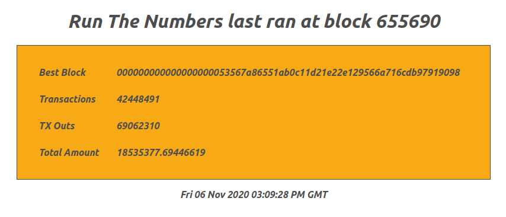

# Run The Numbers

Based on BashCo's [RunTheNumbers](https://github.com/BashCo/RunTheNumbers) script.

Run The Numbers is part of a synchronized decentralized audit of the Bitcoin supply.  A target block height is agreed upon whereby many participants will simultaneously run a similar script on their node.  This version is setup to automatically run as a service, and by default, run the numbers every 5000 blocks, or about once every 34 to 35 days based on a target of 10 minute block times.  Results are saved in the /home/bitcoin/.runthenumbers folder. Instructions for reviewing the results are also outlined below.

Originally this was submitted as a pull request to Stadicus Raspibolt. In the interest of sharing this more widely, I decided to pull it back for enhancements and in a more self contained package to easily allow it to be fitted into other Bitcoin nodes.

Jump to Section
* [Clone this repo](#clone-this-repo)
* [Review and Configure Script](#review-and-configure-script)
* [Run the Numbers Script](#run-the-numbers-script)
* [Autostart on Boot](#autostart-on-boot)
* [Display Results](#display-results)
* [Web Server](#web-server)

---

## Clone this repo

* You'll need to download files in this repository and the fastest way of doing that is cloning

  ```sh
  $ cd /tmp
  $ git clone git@github.com:lucasmoten/runthenumbers.git
  $ cd runthenumbers
  ```

## Review and Configure Script

* As usual, prior to running any script for the first time, you should review what it does

  ```sh
  $ nano runthenumbers
  ```

* The script is heavily commented for convenience.  Alter the settings near the top of the script to set NBLOCK to a value representing every "N'th" block you want the numbers to be run.  

  ```ini
  # Every N Blocks, we run the numbers
  NBLOCK=5000
  SLEEPSECONDS=5
  ```

  Maybe you want this to run more often. Personally I go with every 5 blocks.

* Save and exit the file

## Run the Numbers Script

* As user "admin", copy the "runthenumbers" script in the root of this repository and make executable

  ```sh
  $ sudo cp runthenumbers /usr/local/bin/runthenumbers
  $ sudo chmod +x /usr/local/bin/runthenumbers
  ```

* Create a data directory on the external drive and link it to the "bitcoin" user home.

  ```sh
  $ sudo su - bitcoin
  $ mkdir /mnt/ext/runthenumbers
  $ ln -s /mnt/ext/runthenumbers /home/bitcoin/.runthenumbers
  $ exit
  ```


## Autostart on boot

We want this script to start automatically on system boot.

* As user "admin", copy the "runthenumbers.service" script to the systemd path

  ```sh
  $ sudo cp runthenumbers.service /etc/systemd/system/runthenumbers.service
  ```

* Enable and start RunTheNumbers.

  ```sh
  $ sudo systemctl enable runthenumbers
  $ sudo systemctl start runthenumbers
  ```

* Check the systemd journal to see runthenumbers' log output.
  Exit with `Ctrl`-`C`.

  ```sh
  $ sudo journalctl -f -u runthenumbers
  ```

## Display Results

* The latest results from running the numbers can be displayed as follows

  ```sh
  $ cat /home/bitcoin/.runthenumbers/the_numbers_latest.txt
  ```

* A specific block where numbers were run can be seen thusly

  ```sh
  $ cat /home/bitcoin/.runthenumbers/the_numbers_655000.txt
  ```

* If you just want the total supply as of the last time the numbers were ran

  ```sh
  $ cat /home/bitcoin/.runthenumbers/the_numbers_latest.txt | jq '.total_amount'
  ```

* This same information is conveyed in the journal output

  ```sh
  $ sudo journalctl -u runthenumbers -n 5
  ```

  Example output

  ```c
  -- Logs begin at Mon 2020-10-26 05:17:39 GMT, end at Thu 2020-11-05 14:28:12 GMT. --
  Nov 05 13:53:48 limited bitcoin[31692]: Run The Numbers saw block 655538.
  Nov 05 14:05:32 limited bitcoin[32269]: Run The Numbers saw block 655540. RUNNING THE NUMBERS !!!
  Nov 05 14:10:57 limited bitcoin[32287]: Run The Numbers reports total BTC supply of 18534440.19446619 as of block 655540
  Nov 05 14:11:02 limited bitcoin[32292]: Run The Numbers saw block 655541.
  Nov 05 14:27:33 limited bitcoin[736]: Run The Numbers saw block 655542.
  ```

## Web server

For convenience, we can leverage an existing web server setup to be able to retrieve the results from a web browser.

This setup assumes that you are using a previously setup NGINX, but can be easily adapted to your web server of choice.

* Edit the configuration file

  ```sh
  $ sudo nano /etc/nginx/nginx.conf
  ```

* Add the following inside of an http context, save and exit. 

  ```ini
  server {
    listen 1839;
    root /home/bitcoin/.runthenumbers;
    index the_numbers_latest.htm;
    default_type text/html;
    location / {
      try_files $uri $uri/ =404;
    }
  }
  ```
  This listens on port 1839 and serves up the files in the runthenumbers folder with a default file to be returned when requesting the directory.  Alternatively, you could use other ports such as 1212, 1515, and 1743.

* Enable the port on the firewall

  ```sh
  $ sudo ufw allow from 192.168.0.0/16 to any port 1839 comment 'allow Run the Numbers from local network'
  ```

* Test the NGINX configuration and restart the service.

  ```sh
  $ sudo nginx -t
  ```

  If you encounter errors, do not continue until it is resolved.  I wrote this based on a Stadicus Raspibolt setup of NGINX which relies on the stream context for proxying SSL to backend servers.  If you are adding to the same, you will need to put the server block at the end of the file inside an http context. See documentation for how to use [NGINX as a web server](https://docs.nginx.com/nginx/admin-guide/web-server/web-server/#). 

* Restart the web server

  ```sh
  $ sudo systemctl restart nginx
  ```

* Create a default file to serve up

  ```sh
  sudo echo "Run the Numbers has not yet run" > /home/bitcoin/.runthenumbers/the_numbers_latest.htm
  sudo chmod a+r /home/bitcoin/.runthenumbers/the_numbers_latest.htm
  sudo chown bitcoin:bitcoin /home/bitcoin/.runthenumbers/the_numbers_latest.htm
  ```

* Access in your browser on local network

  http://ip-address-of-your-node:1839/

  Once the numbers have been run at least once, you should get a formatted display that looks similar to this

  